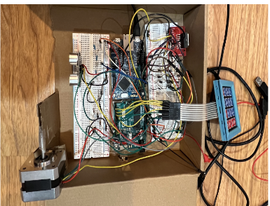
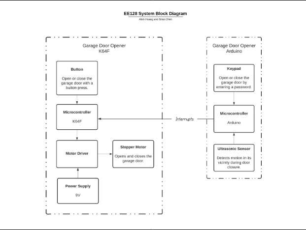
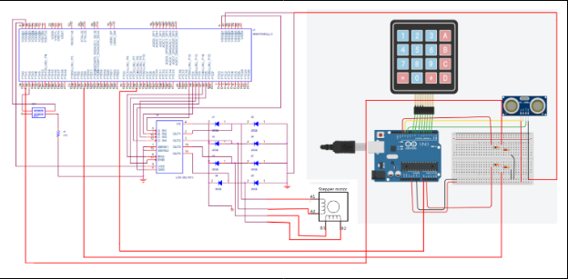

# EE128-Project

# Garage Door System
EE128 Final Project (Arduino + MK64F)

Alvin Hoang \
12/11/2023 \
**Video Link:** https://youtu.be/EKlAHq7ijC4?si=S_1M-_2tlYWYELBS

**Introduction:**
Our project involved developing a garage door opener system using Arduino and K64F microcontrollers.
The system utilizes an Arduino microcontroller to manage the keypad and ultrasonic sensor components. Users can open or close the garage door by entering a password on the keypad. To enhance the system's practicality, we incorporated features for clearing the entered password and modifying the password. Additionally, an ultrasonic sensor was employed to implement an emergency stop mechanism, halting the garage door's closure upon detecting motion in its vicinity. The garage door's operation is controlled by a K64F microcontroller using a stepper motor. The Arduino microcontroller communicates with the K64F microcontroller via interrupts to trigger garage door opening and closing and signal the detection of objects near the garage door by the ultrasonic sensor.

**Complexities:**
* Using a keypad to detect user input
* Using an ultrasonic sensor to detect objects nearby
* Using a stepper motor to rotate the garage door
* Using interrupts on the K64F to trigger all the complexities

**User Guide:**
To open the garage door, the user can press the garage door button inside the garage or enter in the correct password from outside the door. Users can reset the password by typing '##' on the keypad, and to reset entering the password, type '#'. If an object is 20cm or closer to the ultrasonic sensor, the garage door will stop when closing until the object moves out of the way. 

**Hardware:** \
Computing: 
* Ardunio Uno microcontroller
* K64F microcontroller

Inputs: 
* Button
* Keypad

Outputs:
* Stepper Motor

**Wiring Diagram:**

**Block Diagrams:**

**Schematic:**

